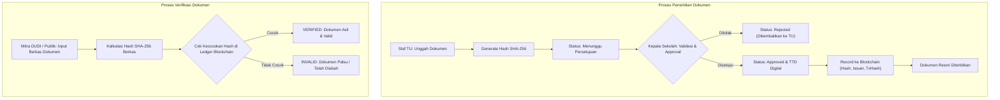

# Sistem Informasi Administrasi SMK
### Perancangan Arsitektur Cloud Security Berbasis Zero Trust dan Integrasi Blockchain untuk Keabsahan Ijazah serta Transkrip Nilai

[](https://www.python.org/)
[](https://flask.palletsprojects.com/)
[](https://csrc.nist.gov/publications/detail/sp/800-207/final)
[]()
[](https://opensource.org/licenses/MIT)

---

## 👤 Informasi Mahasiswa / Pengembang

| Atribut | Keterangan |
|---|---|
| **Nama** | **M. AKBAR JABIR** |
| **NIM** | **105841113323** |
| **Program Studi** | Informatika |
| **Fakultas** | Fakultas Teknik |
| **Institusi** | Universitas Muhammadiyah Makassar |
| **Mata Kuliah** | Cloud Security Architecture |
| **Dosen Pengampu** | Runal Rezkiawan, S.Kom., M.T. |
| **Tahun Akademik** | 2026 |

---

## 📌 Deskripsi Proyek

**Sistem Informasi Administrasi SMK** adalah aplikasi prototype manajemen administrasi sekolah kejuruan yang dirancang dengan mengedepankan standar keamanan data tinggi. Sistem ini mengintegrasikan prinsip **Zero Trust Architecture (ZTA)** untuk pengamanan akses/infrastruktur serta **Blockchain Layer & SHA-256 Cryptographic Hashing** untuk menjamin keaslian dan integritas dokumen akademik (ijazah, transkrip nilai, dan sertifikat Praktik Kerja Lapangan / PKL).

Proyek ini mengatasi masalah pemalsuan dokumen akademik dan akses ilegal (*unauthorized access*) melalui validasi berlapis dan pencatatan riwayat perubahan (*audit trail*) yang tidak dapat dimanipulasi.

> ℹ️ **Catatan Prototype:** Aplikasi web ini berjalan di lingkungan lokal untuk mendemonstrasikan logika backend, RBAC, MFA, SHA-256 hashing, dan simulasi blockchain. Komponen cloud skala produksi (seperti Cloud WAF, AWS Shield/Cloud Armor, Cloud KMS/HSM, Private VPC Subnetting) merupakan bagian dari cetak biru arsitektur keamanan (*Cloud Security Architecture Blueprint*).

---

## 🎯 Tujuan Proyek

1. **Implementasi Prinsip Zero Trust:** Memastikan prinsip *"Never Trust, Always Verify"* diterapkan pada setiap permintaan HTTP, API request, dan sesi pengguna.
2. **Pengendalian Akses Ketat (RBAC):** Membatasi hak akses sistem secara granular berdasarkan peran pengguna (*least privilege*).
3. **Pemberian Autentikasi Ganda (MFA):** Menerapkan Multi-Factor Authentication untuk akun dengan privilese administratif tinggi.
4. **Audit Trail & Monitoring Komprehensif:** Mencatat seluruh transaksi data sensitif, riwayat perubahan nilai, serta upaya akses tidak sah (*unauthorized/forbidden access*).
5. **Integritas Dokumen dengan Blockchain:** Mencegah manipulasi data ijazah, transkrip nilai, dan sertifikat PKL melalui hashing SHA-256 dan hash chaining blockchain.
6. **Verifikasi Mandiri Publik (DUDI / Universitas):** Menyediakan portal verifikasi independen bagi dunia usaha, dunia industri, atau perguruan tinggi untuk menguji validitas dokumen secara *real-time*.

---

## 🛡️ Fitur Keamanan Utama

```
                      ┌──────────────────────────────────────────────┐
                      │          Zero Trust Security Boundary        │
                      └──────────────────────┬───────────────────────┘
                                             │
      ┌──────────────────────┬───────────────┴──────────────┬──────────────────────┐
      │                      │                              │                      │
┌─────▼──────────────┐ ┌─────▼──────────────┐ ┌─────────────▼────────┐ ┌───────────▼──────────┐
│  Identity & RBAC   │ │ Multi-Factor Auth  │ │ Audit & Monitoring   │ │ Blockchain Integrity │
│  - Least Privilege │ │ - TOTP / MFA OTP   │ │ - Activity Logging   │ │ - SHA-256 Hashing    │
│  - Session Control │ │ - Admin Protection │ │ - SecOps Dashboard   │ │ - Hash Chaining      │
│  - 403 Forbidden   │ │ - Session Guard    │ │ - Threat Alerting    │ │ - Public Validation  │
└────────────────────┘ └────────────────────┘ └──────────────────────┘ └──────────────────────┘
```

### 1. Zero Trust & Identity Access Management (IAM)
- **Role-Based Access Control (RBAC):** Pengecekan otorisasi ketat di level backend (Route Decorator & Context Processors).
- **Enforcement 403 Forbidden:** Setiap percobaan akses ilegal ke endpoint yang tidak diizinkan langsung diblokir dan dicatat ke log keamanan.
- **Session-Based Verification:** Validasi status login dan peran pada setiap *request lifecycle*.

### 2. Multi-Factor Authentication (MFA)
- Perlindungan otentikasi lapis kedua khusus untuk akun berprivilese tinggi (**Kepala Sekolah** dan **Staf TU**).
- Verifikasi kode OTP sebelum izin akses administratif diberikan.

### 3. Audit Logging & Security Operations (SecOps)
- **Comprehensive Audit Trail:** Mencatat log aktivitas pengguna lengkap dengan *timestamp*, *IP address*, *endpoint*, *action*, dan detail perubahan.
- **Grade Change Audit:** Setiap perubahan nilai siswa oleh guru terdokumentasi dengan nilai lama, nilai baru, dan aktor pengubah.
- **Security Dashboard:** Visualisasi log ancaman, *access denied events*, dan metrik integritas sistem.

### 4. Blockchain & Document Integrity Layer
- **SHA-256 Cryptographic Hashing:** Setiap dokumen yang diunggah/diterbitkan dihitung nilai *digest*-nya secara unik.
- **Simulated Blockchain Ledger:** Transaksi hash dokumen dicatat dalam blok-blok berantai (*hash chaining* dengan *genesis block*).
- **Approval Workflow:** Ijazah membutuhkan tanda tangan/persetujuan resmi dari Kepala Sekolah sebelum dicatat ke dalam blockchain.

---

## 👥 Matriks Hak Akses Pengguna (User Roles & Permissions)

| Role / Peran | Dashboard | Data Siswa | Input & Edit Nilai | Buat Dokumen (Ijazah/PKL) | Approval Ijazah | Verifikasi Publik | Audit & SecOps Log |
|---|:---:|:---:|:---:|:---:|:---:|:---:|:---:|
| 🎓 **Siswa** | View | Profil Sendiri | View (Nilai Sendiri) | ❌ | ❌ | ✅ | ❌ |
| 👨‍🏫 **Guru** | View | View Kelas | Create / Update | ❌ | ❌ | ✅ | ❌ |
| 🧑‍💼 **Staf TU** | Full | CRUD | View | Create / Submit | ❌ | ✅ | View |
| 👔 **Kepala Sekolah** | Full | View | View | View | Approve / Reject | ✅ | View / Monitor |
| 🏢 **Mitra DUDI** | View | ❌ | ❌ | ❌ (View PKL) | ❌ | Full Verification | ❌ |

---

## 🔄 Alur Keamanan & Verifikasi Dokumen



---

## 📁 Struktur Direktori Proyek

```text
sistem-informasi-administrasi-smk/
├── app.py                   # Main entry point aplikasi Flask
├── database.py              # Inisialisasi skema SQLite, trigger, & data seeding
├── blockchain.py            # Modul logika blockchain simulation & hash chaining
├── rbac.py                  # Definisi peran, perizinan, dan dekorator RBAC
├── requirements.txt         # Daftar pustaka Python (Flask, Werkzeug)
├── smk_admin.db             # Database SQLite lokal (dibuat otomatis)
├── uploads/                 # Direktori penyimpanan berkas dokumen/ijazah
├── routes/                  # Blueprint modular rute aplikasi
│   ├── __init__.py
│   ├── auth.py              # Login, Logout, MFA handling
│   ├── dashboard.py         # Tampilan dashboard per role
│   ├── students.py          # Manajemen data siswa
│   ├── grades.py            # Pengelolaan nilai & riwayat nilai
│   ├── certificates.py      # Pengajuan & pencetakan ijazah
│   ├── approval.py          # Otorisasi ijazah oleh Kepala Sekolah
│   ├── internship.py        # Pengelolaan sertifikat PKL DUDI
│   ├── verification.py      # Portal verifikasi hash dokumen publik
│   ├── audit.py             # Riwayat log aktivitas & perubahan data
│   ├── security.py          # SecOps Dashboard & visualisasi ancaman
│   └── users.py             # Manajemen pengguna sistem
├── static/                  # Berkas CSS, JavaScript, dan asset visual
└── templates/               # Berkas template UI HTML (Jinja2)
```

---

## 🚀 Panduan Instalasi & Menjalankan Sistem

### 1. Prasyarat Sistem
- Python 3.10 atau versi lebih baru
- Git
- Web Browser modern (Google Chrome, Firefox, Microsoft Edge)

### 2. Clone Repositori
```bash
git clone https://github.com/AkbarJabir/sistem-informasi-administrasi-smk.git
cd sistem-informasi-administrasi-smk
```

### 3. Setup Virtual Environment (Opsional namun Disarankan)
```bash
# Windows
python -m venv venv
venv\Scripts\activate

# Linux / MacOS
python3 -m venv venv
source venv/bin/activate
```

### 4. Instalasi Dependensi
```bash
pip install -r requirements.txt
```

### 5. Jalankan Aplikasi
```bash
python app.py
```
Buka peramban dan akses alamat: **`http://127.0.0.1:5000`**

---

## 🔑 Akun Uji Coba (Demo Credentials)

Aplikasi telah dilengkapi dengan data awalan (*seed data*) untuk pengujian fungsionalitas seluruh role:

| Peran (Role) | Email Login | Password | MFA Status | Catatan Akses |
|---|---|---|---|---|
| 🎓 **Siswa** | `siswa@smk.sch.id` | `siswa123` | Nonaktif | Hanya dapat melihat data diri & rapor |
| 👨‍🏫 **Guru** | `guru@smk.sch.id` | `guru123` | Nonaktif | Mengelola input dan modifikasi nilai |
| 🧑‍💼 **Staf TU** | `tu@smk.sch.id` | `tu123` | **Aktif (MFA)** | Kelola siswa & generate draft ijazah |
| 👔 **Kepala Sekolah** | `kepsek@smk.sch.id` | `kepsek123` | **Aktif (MFA)** | Otorisasi ijazah & pantau SecOps |
| 🏢 **Mitra DUDI** | `dudi@industry.co.id` | `dudi123` | Nonaktif | Kelola PKL & verifikasi keaslian dokumen |

> 💡 *Untuk akun dengan MFA aktif, gunakan kode OTP simulasi yang tertera pada layar pengujian.*

---

## 🧪 Pengujian Keamanan & Endpoint API

Sistem dilengkapi dengan API endpoint pengujian Zero Trust yang memvalidasi otorisasi di level backend:

- **Endpoint:** `POST /api/v1/grades/update`
- **Uji Akses Tidak Sah:** Mengirim *request* pembaruan nilai menggunakan akun selain `guru` akan menghasilkan respons `403 Forbidden` dan langsung memicu *event* `ACCESS_DENIED` pada tabel `audit_logs`.

---

## 📝 Kesimpulan & Rencana Pengembangan

Implementasi rancangan ini membuktikan bahwa perpaduan **Zero Trust Architecture** dan **Blockchain Ledger**:
1. Menghilangkan ketergantungan pada kepercayaan implisit (*implicit trust*) pada jaringan internal.
2. Memberikan jaminan integritas data akademik terhadap ancaman perubahan ilegal baik dari pihak internal maupun eksternal.
3. Memungkinkan proses verifikasi dokumen yang terdesentralisasi, transparan, dan dapat diandalkan oleh industri dan perguruan tinggi.

---

**© 2026 M. Akbar Jabir (105841113323) — Tugas Akhir Cloud Security Architecture**
